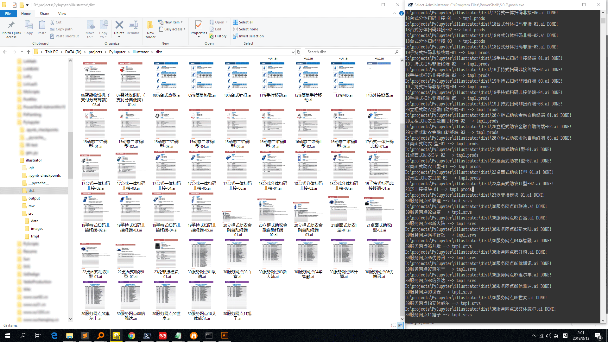

这是一个用python操作Illustrator的示例。
它将excel表格拆分成独立的统一格式的数据，然后写入预先设计好的ai模板，将ai文件合并输出最终的pdf画册。

> 测试环境：
>
> **Windows 10 Pro（10.0.17134，64位）**
> **Adobe Illustrator CC2018（22.1，64位）**
> **Python 3.7.3**

我把项目分为4个脚本来写，以便你可以跳过不感兴趣的步骤，直接测试需要的部分。

## 00
`00processing_images.py`调用`imagemagick`统一图片格式何尺寸，最终收集所有图片保存在`example_catalog\src\images`。需要额外安装[imagemagick](<https://www.imagemagick.org/>)，可跳过。

## 01
`01cleaning_data.py`是拆分表格直到每个表格仅包含一种产品的数据，最终每个表格会输出一个json文件并保存在`example_catalog\src\data`。
需要安装`pandas`：

```shell
pip install pandas
```
建议在确认你已安装python3之后创建虚拟环境并一次性安装所有依赖：
```shell
pip install -r requirements.txt
```

## 02
`02gen_ai_files.py`是在Illustrator里遍历`example_catalog\src\data`文件夹，逐个载入json数据并从`example_catalog\src\tmpl`适配相应的设计模板，最终每个json生成一个ai文件并保存在`example_catalog\dist`。

需要安装`pywin32`：

```shell
pip install pypiwin32
```

## 03

`03export_combined_pdf.py`收集`example_catalog\data`里的文件名，结合`example_catalog\tmpl\tmpl_toc.ait`生成目录；给`example_catalog\dist`里的ai文件添加页码，根据页码切换左右布局，并组合成册保存为`example_catalog\output.pdf`。
需要安装`PyPDF2`：

```shell
pip install PyPDF2
```


更详细说明可看[这里](http://www.xuchengjing.cn/用python做一本画册01/)

